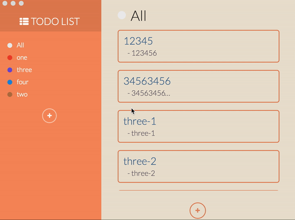

# Achiever
Share saved data in your group.

## Install
~~~bash
$ git clone https://github.com/jicjjang/achiever
$ cd achiever
$ npm install
~~~

## Usage
~~~bash
$ npm run start
~~~

## Test
~~~bash
$ npm run test
~~~
