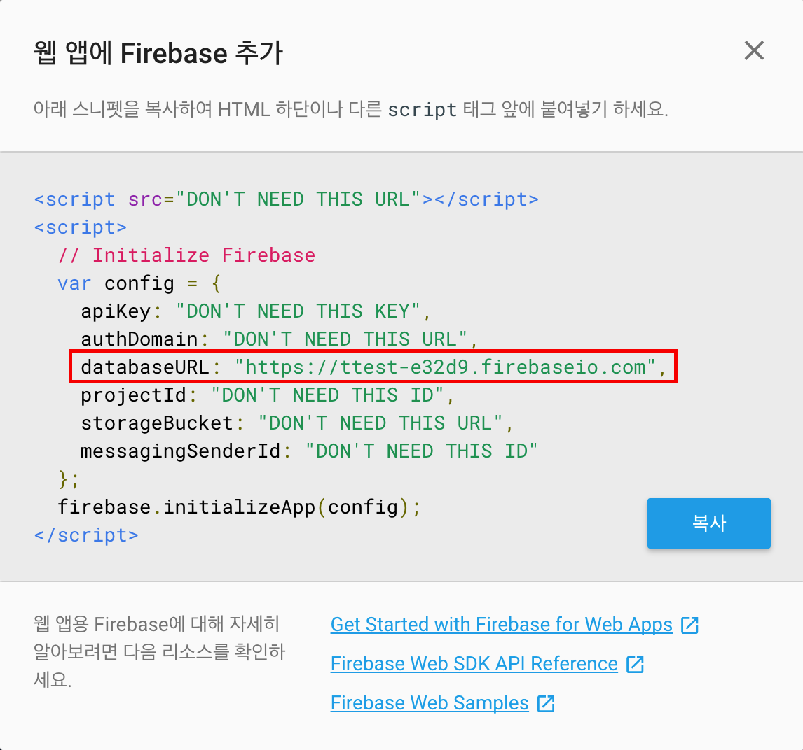

# Achiever
Share saved data in your group.

## Install
~~~bash
$ git clone https://github.com/jicjjang/achiever
$ cd achiever
$ npm install
~~~

## Set config

#### 1. Need firebase `DATABASE_URL`
##### Connect "https://console.firebase.google.com/" URL

#### 2. Make your firebase application

#### 3. Look at the `ex.config.js` file and make `config.js` file
~~~bash
$ vi ./app/config.js  # look at the `ex.config.js file`
~~~

#### 4. Write your firebase db url
~~~javascript
// config.js
export const DATABASE_URL = 'YOUR_FIRBASE_DB_URL'
~~~

## Usage
~~~bash
$ npm run start
~~~

## Test
~~~bash
$ npm run test
~~~
